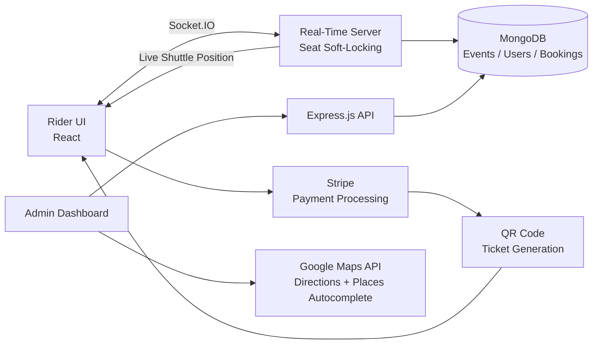

# ShuttleNow

**Real-Time Shuttle Booking & Live Tracking Platform**


[](./LICENSE)


[](https://stripe.com/)
[](https://github.com/hemu1808/ShuttleNow/commits/main)
[](https://github.com/hemu1808/ShuttleNow/issues)
[](https://github.com/hemu1808/ShuttleNow/pulls)

---

## Table of Contents

- [Overview](#overview)
- [Architecture](#architecture)
- [Key Features](#key-features)
- [Tech Stack](#tech-stack)
- [Project Structure](#project-structure)
- [Getting Started](#getting-started)
- [Roadmap](#roadmap)
- [Use Cases](#use-cases)
- [Contributing](#contributing)
- [License](#license)

## Overview

ShuttleNow is a full-stack booking platform that gives riders a live, conflict-free seat-selection experience and gives operators a real-time view of their fleet — instead of the static, refresh-to-check booking flow most shuttle and transit sites still use.

The system is split into two cooperating subsystems:

- **Subsystem A — Real-Time Booking.** A Socket.IO layer soft-locks seats the instant a rider selects them, broadcasting availability to every connected client so two people can never book the same seat. Bookings flow through Stripe and resolve into a QR-coded digital ticket.
- **Subsystem B — Operations & Live Tracking.** An admin portal with full event CRUD, Google Places–powered location entry, and live map tracking that streams a shuttle's simulated position to every rider watching that route.

## Architecture



## Key Features

- 🎟️ Real-time seat selection with Socket.IO "soft locking" — a seat taken by one user instantly shows as unavailable to everyone else
- 🔐 Dual authentication system — separate JWT-secured portals for riders and admins
- 🗺️ Interactive Google Maps integration — live route drawing via the Directions API and live shuttle position updates over WebSockets
- 🖥️ Full admin dashboard — event CRUD with Google Places Autocomplete so admins can type a location name and get accurate lat/lng automatically
- 🎫 Flexible booking — profile-based bookings saved to "My Bookings," or frictionless guest checkout with just a phone number
- 📱 Digital QR-code tickets generated on successful payment, viewable on the success page and in-profile, scannable for entry verification
- 🎨 Modern, responsive UI — two-column layout, Framer Motion transitions, and a dark/light theme toggle

## Tech Stack

| Frontend | Backend | Real-Time / Payments | Infra & APIs |
|---|---|---|---|
| React | Node.js + Express.js | Socket.IO (soft-locking, live tracking) | MongoDB + Mongoose |
| React Router | JWT authentication | Stripe (payment processing) | Google Maps API (`@react-google-maps/api`) |
| Axios | bcryptjs (password hashing) | `qrcode` (ticket generation) | Google Directions & Places Autocomplete |
| Framer Motion | Socket.IO Client | | |

## Project Structure

```
.
├── backend/
│   ├── models/
│   ├── routes/
│   ├── controllers/
│   ├── sockets/                    # Socket.IO seat-locking + live tracking
│   └── server.js
├── frontend/
│   ├── src/
│   │   ├── components/
│   │   ├── pages/
│   │   ├── context/
│   │   └── lib/                    # Maps, Socket.IO client, API helpers
│   └── public/
├── .env.example
└── README.md
```

## Roadmap

- [x] Phase 1 — Core MERN stack: event display & booking logic
- [x] Phase 2 — Real-time layer: Socket.IO seat soft-locking
- [x] Phase 3 — Admin authentication & event CRUD panel
- [x] Phase 4 — User authentication, guest checkout, profile management
- [x] Phase 5 — Google Maps integration: live route drawing + Places Autocomplete
- [x] Phase 6 — Stripe payments & QR-code digital tickets
- [ ] Automated test coverage & CI
- [ ] Native mobile app / PWA offline support
- [ ] Admin analytics dashboard (occupancy, revenue trends)
- [ ] Multi-shuttle / multi-route fleet management

> *These last four are suggested next steps — swap in whatever's actually next on your list.*

## Use Cases

- **Event shuttle services** — festival, conference, or stadium shuttles where seat conflicts and no-shows are costly
- **Corporate transit programs** — employee shuttle booking with guest checkout for visitors
- **Campus & venue operations** — admins spin up new routes in minutes via Places Autocomplete instead of manually pinning coordinates

## Why ShuttleNow?

Most shuttle-booking demos stop at a static form and a confirmation email.

ShuttleNow adds the pieces that make a booking system feel live: seats
lock the instant they're selected, riders watch their shuttle move on
the map in real time, and every ticket is a verifiable QR code — not
just an email receipt.

## Current Status

| Component | Status |
|------------|:------:|
| Backend API | ✅ |
| MongoDB Models | ✅ |
| Socket.IO Seat Locking | ✅ |
| User Authentication (JWT) | ✅ |
| Admin Authentication | ✅ |
| Admin Event CRUD | ✅ |
| Google Maps / Directions | ✅ |
| Google Places Autocomplete | ✅ |
| Stripe Payments | ✅ |
| QR Code Ticketing | ✅ |
| Guest Checkout | ✅ |
| Live Shuttle Tracking | ✅ |
| Dark/Light Theme | ✅ |
| Unit & Integration Tests | ⬜ |
| CI/CD Pipeline | ⬜ |

*(⬜ = update these two rows to reflect where things actually stand.)*

## ⚡ Real-Time Booking Flow

```text
                     User Opens Event
                           │
                           ▼
                  Seat Selection Map
        ┌─────────────────────────────────────┐
        │ • Fetch live seat map (Socket.IO)   │
        │ • Select a seat                     │
        │ • Broadcast soft-lock to all users  │
        └─────────────────────────────────────┘
                           │
                           ▼
                    Checkout Flow
        ┌─────────────────────────────────────┐
        │ Profile Booking    OR   Guest        │
        │ (JWT session)           (phone only) │
        └─────────────────────────────────────┘
                           │
                           ▼
                  Stripe Payment
        ┌─────────────────────────────────────┐
        │ • Secure payment processing         │
        │ • Booking confirmed                 │
        └─────────────────────────────────────┘
                           │
                           ▼
              Digital Ticket Issued
        ┌─────────────────────────────────────┐
        │ • Unique QR code generated          │
        │ • Saved to success page / profile   │
        │ • Scanned for entry verification    │
        └─────────────────────────────────────┘
```

## Getting Started

### Prerequisites

- Node.js v18+ & npm
- MongoDB (local or Atlas)
- A Stripe secret key
- A Google Maps API key (Maps JavaScript, Directions, and Places APIs enabled)

### 1. Clone and configure

```bash
git clone https://github.com/hemu1808/ShuttleNow.git
cd ShuttleNow
```

### 2. Backend setup

```bash
npm install
# Create a .env file and add MONGO_URI, STRIPE_SECRET_KEY, JWT_SECRET
node server.js
```

### 3. Frontend setup

```bash
cd frontend
npm install
# Create a .env file and add REACT_APP_GOOGLE_MAPS_API_KEY
npm start
```

Visit `http://localhost:3000`, pick an event, and select a seat to see the real-time soft-locking, live map, and ticketing flow end to end.


## Contributing

Contributions are welcome. Please open an issue to discuss scope before submitting a large pull request. Bug reports, documentation improvements, and test coverage are especially appreciated at this stage.

## License

*(Not yet specified — add a `LICENSE` file and update this section, e.g. MIT/Apache 2.0.)*

## Author

**Hemanth Kumar Mangalapurapu** — [github.com/hemu1808](https://github.com/hemu1808)
